

    
	<h1>Marsher「棉花串」</h1>
    
    
    

> 「有了Marsher，棉花糖回天天开。」
>
> 摆脱棉花糖回的截图→放OBS图片源工作流。一键操作的时代，现已到来。

Marsher为一个在本地整理、展示来自マシュマロ（棉花糖/MarshmallowQA）、Peing等匿名提问箱的提问的工具。

## 背景

某次DD的时候看到有主播吐槽每次做棉花糖回都需要预先截图（/下载）所有需要的棉花糖，然后在直播的时候用OBS一张一张切换。因此制作了这个小工具来方便整理展示匿名提问。

## 两张图说话

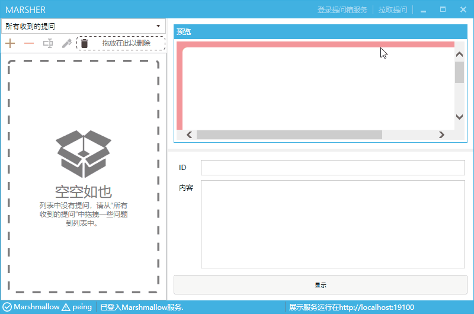  
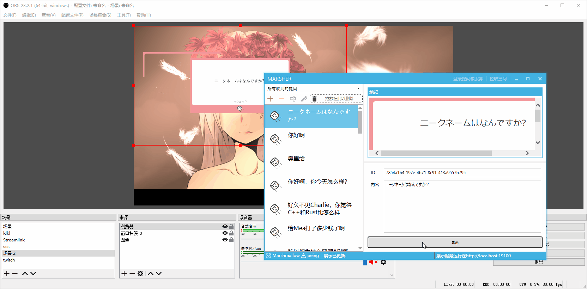

## 功能与特性

- 直播展示：与OBS、直播姬联动，一键切换；
- 自动拉取：与マシュマロ、Peing联动，用Twitter或帐号登录后可一键拉取收到的提问；
- 提问列表：想针对某次直播单独列出挑选出的棉花糖？新建一个列表即可！
- 高效整理：使用拖动的方式让棉花糖在列表之间穿梭；
- 易于使用：一键安装免配置，电脑杂鱼也能快速上手！
- 小巧便捷：整个程序压缩后仅7MB不到，解压后仅20MB不到，极致轻便。
- 优雅美观：UI设计简明，且OBS上的展示器支持渐变动画；
- 开源免费

## 先决条件

你需要以下环境以使用Marsher。除Windows以外通常这些条件是自带或会被自动配置好的。

1. Windows 7 SP1 及以上系统（**强烈建议使用Windows 10**）；
2. .NET Framework 4.7.2及以上（通常自带，且在支持的操作系统上会自动安装）；
3. Internet Explorer 11（Windows 8.1/10自带，其他系统用户可自行安装）；

## 获取

你可以在以下链接下载安装最新的Marsher：

https://soft.danmuji.org/Marsher/Marsher-Setup-1.0.0.exe

直接运行安装包可一键安装。

关于安装：

- 第一次启动时可能弹出Windows防火墙提示，这是由于Marsher需要在本地启动一个服务器以供OBS等调用。请选择“**解除限制**”或“允许”；
- 如果你的系统没有安装.NET Framework 4.7.2，则安装程序会自动联网安装。但是在中国大陆访问Microsoft的服务器较慢，因此建议自行于[官网下载离线安装包安装](http://go.microsoft.com/fwlink/?linkid=863265)；当安装出错的时候也可以考虑使用离线安装包；
- 由于Windows 7上需要单独安装Internet Explorer 11与.NET Framework，且.NET Framework安装可能出现神秘问题，因此强烈建议使用Windows 10；

### 关于安全的问题

由于涉及到关键帐号信息，因此你可能会在意本程序的安全问题。本程序的官方发布版本绝对无毒（不信你可以自己审查代码自己编译……），且我们不会收集任何数据，无论匿名与否。但是不保证网上非官方渠道传播的已编译文件的安全性。因此建议永远仅使用来自下列来源的程序：

1. DD Center编译的（即上述下载链接下载到的）Marsher；
2. 自己或可信任方编译的Marsher（注意即使是可信任的人传给你的版本同样可能来自不可信的编译者！）；

## 使用

以下所有步骤以マシュマロ（棉花糖）提问箱为例，Peing同理。

### 代理

如果您在中国大陆，您可能需要魔法上网。Marsher的所有网络访问会通过你的系统的代理访问网络。对于“艾斯艾斯R”等工具，通常将其“系统代理模式”设置为“全局代理”即可。不过需要注意在拉取完提问后须记得还原该设置（“直连模式”），若系统最初的设置不是全局模式。

关于此话题的更多问题，请咨询您的技术支持（对于企业势）或私信我。

### 登录棉花糖服务

在右上角的“登录提问箱服务”中选择“登入Marshmallow服务”。

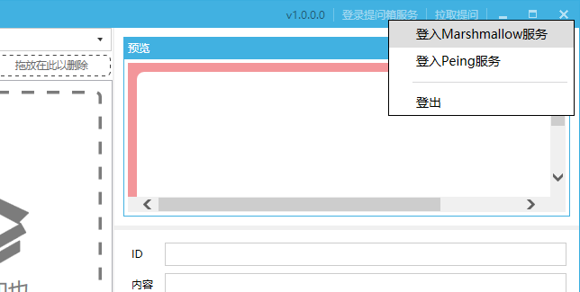

一个浏览器窗口会打开并转到マシュマロ主页。

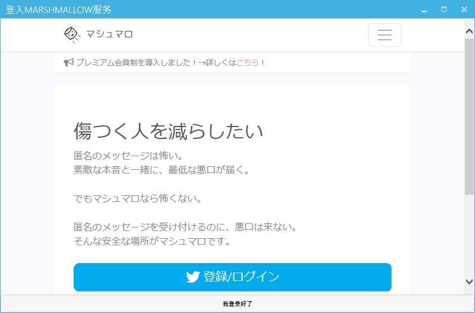

请用你通常的登录方式登录マシュマロ，并转到个人页面。最后，点击“我登录好了”按钮。

> 对peing用户而言，可能会弹出Internet Explorer的错误窗口，或出现显示错位等问题。不必理会，直接登录即可。出现下面界面就说明登录成功了。
>
> // 图n

几秒后，Marsher左下角应该提示Marshmallow服务可用。

### 拉取

单击右上角的“拉取提问”，即会从所有提问箱服务拉取收到的提问。

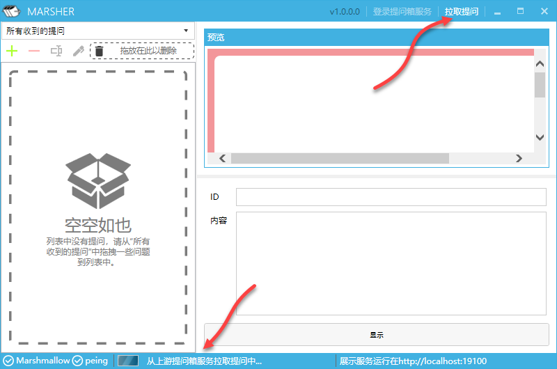

> **注意**：目前的版本会拉取**所有**收到的提问，只要其不在本地存储中。因此如果长期不清理帐号中的提问，单次拉取会占用大量时间。以后会考虑添加批量清理帐号中提问（而非本地提问）的功能（参见「在下个版本可能会添加的内容」一节）。
>
> 另外Peing用户也可以在拉取后自行打开浏览器，使用Peing的“标记所有为已读”功能。

拉取后会呈现在“所有收到的提问”列表中。

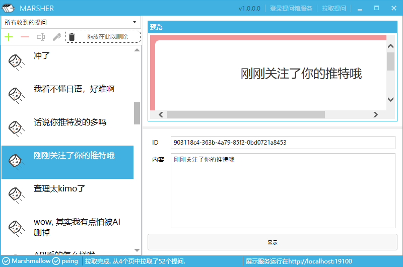

选择一个提问，即可在右侧对其进行编辑。所有的编辑都是自动保存的。

### 列表与整理

提问列表是用于整理收到的棉花糖以用于展示的工具。单击左上角列表选择器下方的“＋”号新建一个列表，并为列表命名。

> 提示：建议用直播场次来命名列表，例如“11.23棉花糖台词回”	

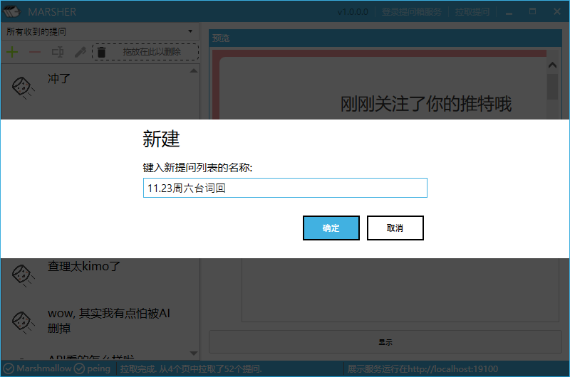

新建后会自动打开整理器窗口。同时你可以通过左上角的复选框选择当前主窗口中的列表。

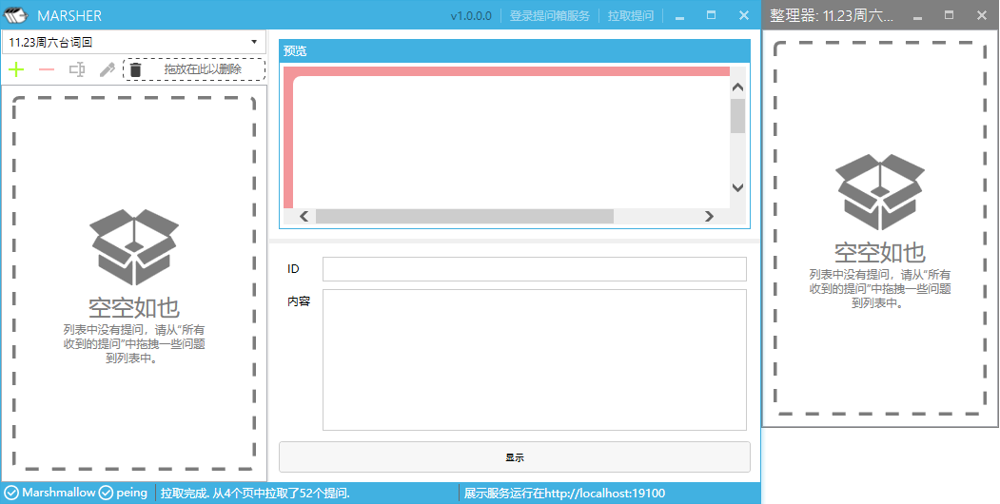

若关闭了整理器窗口，你随时可以在主窗口中选择想要编辑的列表，并单击下方的“🖊”按钮重新打开整理器。

通常，你需要将“所有收到的提问”中的提问拖动到整理器窗口中。你也可以按住Ctrl多选，亦可拖动以调整各个问题的位置（注意，“所有收到的提问”中的提问不可调整位置，也不可将列表中的提问拖动到“所有收到的提问”）。

若想删除列表中的某个提问，将其拖动到主窗体中“拖放在此以删除”处即可。

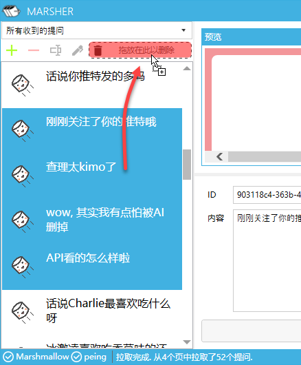

> 注意，如果从“所有收到的提问”中拖动提问到“拖放在此以删除”区域，则这个提问会被从本地存储，以及**所有列表**中删除。
>
> 建议在删除所有问题的时候，保留最后一个问题（即最后收到的一个问题）。这样可以防止在下一次拉取的时候再次拉取到上次删除的问题。或者，你可以手动在网页中将提问标记为已读。

在编辑完毕后可关闭整理器。在直播时在主窗口中选择该列表即可。

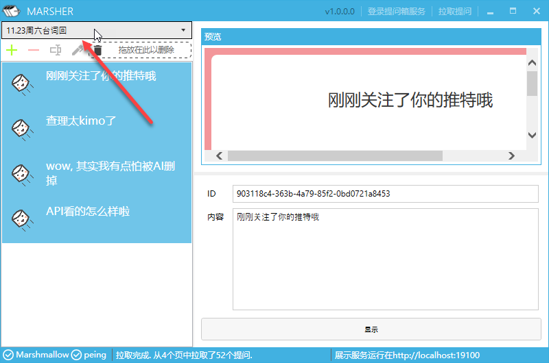

### 展示

以下以OBS为例。

首先你需要启动Marsher并保证右下角提示展示服务运行中。

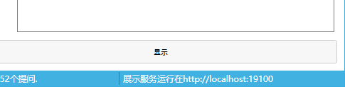

在OBS中添加一个浏览器源，并在地址一栏中填入“`http://localhost:19100/index.html`”，设置长度宽度为直播画布的长度、宽度（例如若你使用720p推流，则使用长度1280、宽度720；1080p推流则为长度1920宽度1080）。关于其他设置的进一步解读，请联系你的技术支持。

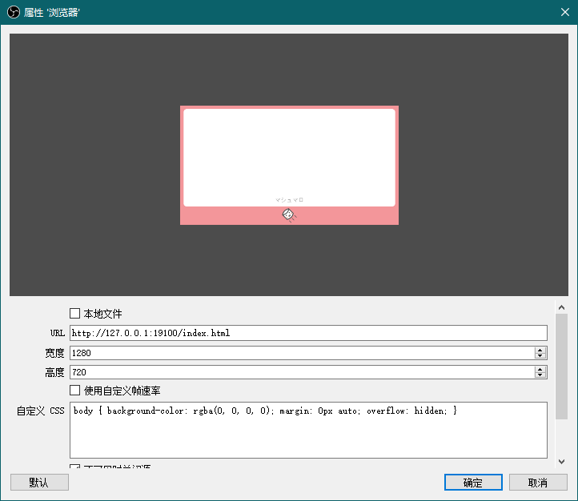

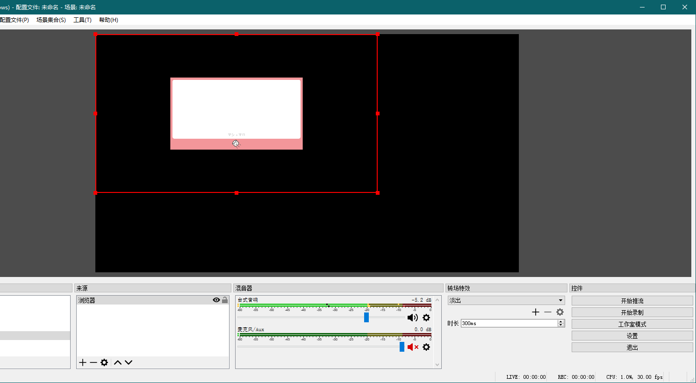

调整浏览器源到正确的位置，并进行合理的缩放。

此时可尝试在Marsher主界面中选择一个提问，并单击“显示”。

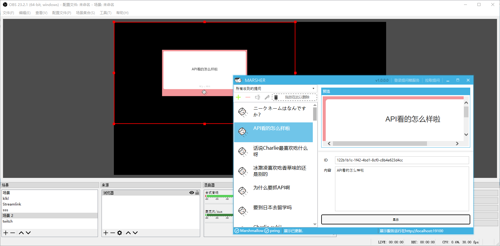

若一切正常，OBS中的提问显示也会随之改变。重复上述操作，即可实现快速切换当前展示的提问。

> 如遇到无法切换的情况，请尝试重启Marsher并打开浏览器源的设置，单击最下方的“刷新当前页面缓存”。

## 在下个版本可能会添加的内容

如果有足够多的反馈表示需求，那么在下一个版本可能加入这些功能：

- 同屏显示多个提问
- 列表倒序浏览
- 批量删除/标记回答服务端的棉花糖
- 修复预览功能

## Contributers

- Charlie Jiang：程序、UI
- Il Harper：LOGO、头图
- yuyuyzl：UI顾问
- genteure：下载与更新服务器
- 某不愿透露姓名的DD：日语翻译

## 来自群组：GitHub DD Center

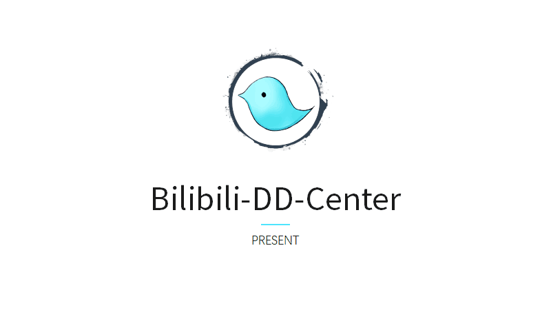

DD Center是一个主要活动于虚拟主播领域的程序员社团。

DD Center的其他产品：

- [bilisc.com](https://bilisc.com/)：Bilibili醒目留言实时监控站
- [vtbs.moe](https://vtbs.moe)：VTBs in Bilibili！环哔哩哔哩虚拟主播圈数据中心
- [BiliChat](https://bilichat.3shain.com/)： B站仿油管样式评论机，更多主播使用的哔哩哔哩弹幕框
- and more......

## Funding

如果觉得我的程序有所帮助，你可以考虑给我买瓶水什么的。可以点击repo上方的“Sponsor”（Patreon），或扫码（微信）。

    

